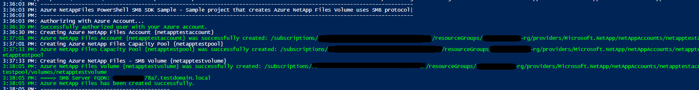

# Azure NetAppFiles SDK SMB Sample Powershell

This project demonstrates how to use Powershell with NetApp Files SDK for Microsoft.NetApp resource provider to deploy SMB Volume.

In this sample application we perform the following operations:

* Creation
  * Azure NetApp Account
  * Capacity pool 
  * SMB Volume  
 
* Deletion
	The clean-up process takes place, deleting all resources in the reverse order following the hierarchy. Otherwise we can't remove resources that have nested resources still live. (The clean-up proess is not enabled by default. You need to  set the parameter CleanupResources to $true if you want the clean up code to take a place.)


If you don't already have a Microsoft Azure subscription, you can get a FREE trial account [here](http://go.microsoft.com/fwlink/?LinkId=330212).

## Prerequisites

1. Azure subscription.
2. Subscription needs to have Azure NetApp Files resource provider registered. For more information, see [Register for NetApp Resource Provider](https://docs.microsoft.com/en-us/azure/azure-netapp-files/azure-netapp-files-register).
3. Resource Group created.
4. Virtual Network with a delegated subnet to Microsoft.Netapp/volumes resource. For more information, please refer to [Guidelines for Azure NetApp Files network planning](https://docs.microsoft.com/en-us/azure/azure-netapp-files/azure-netapp-files-network-topologies)
5. Azure PowerShell, please refer to [Install Azure PowerShell](https://docs.microsoft.com/en-us/powershell/azure/install-az-ps?view=azps-4.8.0)
6. Run the following PS command:
	* Install-Module Az.NetAppFiles
7. Active Directory infrastructure setup with one or more DNS servers from the AD domain (usually the Domain Controllers) available in the same virtual network where you're setting up Azure NetApp Files. If you want to setup an Active Directory test environment, please refer to [Create a new Windows VM and create a new AD Forest](https://github.com/Azure/azure-quickstart-templates/tree/master/active-directory-new-domain#create-a-new-windows-vm-and-create-a-new-ad-forest-domain-and-dc), Domain and DC for a quick setup, then you can work on the vnet that gets created to setup the subnet requirements for ANF.

# How the project is structured

The following table describes all files within this solution:

| Folder     | FileName                | Description                                                                                                                         												 |
|------------|-------------------------|-------------------------------------------------------------------------------------------------------------------------------------------------------------------------------------|
| src        | CreateANFVolume.ps      | Authenticates and executes all operations                                                                                           												 |
| src\Common | CommonOperations.psm1   | PowerShell module that exposes some functions to perform creation and deletion Azure NetApp Files resource that calls the actual Az.NetAppFiles cmdlets							 |
| src\Common | Utils.psm1              | Static class that exposes a few methods that helps on various tasks, like writting a log to the console for example.                												 |
| src\Common | AzureAuth.psm1	       | PoweShell module that exposes functions to connect to Azure and choose target subscription                                          												 |

# How to run the PowerShell script

1. Clone the script locally:
    ```powershell
    git clone https://github.com/Azure-Samples/netappfiles-powershell-nfs-sdk-sample.git
    ```
	
1. Modes: There are two options to run the script: 

	Basic mode - Single script create Azure NetApp files with no validation.
	 * Change folder to **netappfiles-powershell-smb-script-sample\src\Basic**
	 * Open CreateANFVolume and edit all the parameters
	 * Save and close
	 * Run the following command
	 ``` powershell
	 CreateANFVolume.ps1
	 ```

	OR
	
    Advanced mode - More advanced way to run the script to create Azure Netapp Files with validation using modules
	 * Change folder to **netappfiles-powershell-smb-script-sample\src\Advanced**
	 * Change values bewtween brackets [ ] below and then run the command 
     ```powershell 
	 CreateANFVolume.ps1 -SubscriptionId '[subscriptionId]' -ResourceGroupName '[Azure Resource Group Name]' -Location '[Azure Location]' -NetAppAccountName '[ANF Account Name]' -NetAppPoolName '[ANF Capacity Pool Name]' -ServiceLevel [Ultra,Premium, Standard] -NetAppVolumeName '[ANF Volume Name]' -SubnetId '[Subnet ID] -DomainJoinUsername '[Username]' -DomainJoinPassword '[Password]' -DNSList 'DNS List' -ADFQDN 'Domain Name' -SmbServerNamePrefix 'SMB Server Name'
     ```
	
	>Note: The below table shows all the mandatory and optional parameters
	
	| Parameter  			| Mandatory | Default Value |
	|-----------------------|-----------|---------------|
	| -SubscriptionId   	| Yes		| 				|
	| -ResourceGroupName	| Yes       | 				|
	| -Location 			| Yes       | 				|
	| -NetAppAccountName	| Yes		|				|
	| -NetAppPoolName		| Yes		|				|
	| -ServiceLevel			| Yes		|				|
	| -NetAppPoolSize		| No		| 4398046511104 |
    | -NetAppVolumeName		| Yes		|				|
    | -ProtocolType			| Yes		| 				|
    | -NetAppVolumeSize		| No		| 107374182400	|
    | -SubnetId				| Yes		|				|
    | -DomainJoinUsername	| Yes		|	 			| 
    | -DomainJoinPassword	| Yes		| 				|
    | -DNSList				| Yes		| 				|
	| -ADFQDN             	| Yes		|				|
	| -SmbServerNamePrefix 	| Yes		|				|
    | -CleanupResources		| No		| False			|
	
	
	Sample output
	

# Troubleshoot

If you encounter the below issue when running the PoweShell command: 

```
.\CreateANFVolume.ps1 : .\CreateANFVolume.ps1 cannot be loaded. The file .\CreateANFVolume.ps1 is not digitally signed. You cannot 
run this script on the current system.
```

Run the following command: 
Set-ExecutionPolicy -Scope CurrentUser -ExecutionPolicy Bypass

# References

* [Sign in with Azure PowerShell](https://docs.microsoft.com/en-us/powershell/azure/authenticate-azureps?view=azps-4.8.0)
* [Azure PowerShell AZ Module](https://docs.microsoft.com/en-us/powershell/azure/new-azureps-module-az?view=azps-4.8.0)
* [AZ.NetAppFile](https://docs.microsoft.com/en-us/powershell/module/az.netappfiles/?view=azps-4.8.0#netapp-files)
* [Resource limits for Azure NetApp Files](https://docs.microsoft.com/en-us/azure/azure-netapp-files/azure-netapp-files-resource-limits)
* [Azure Cloud Shell](https://docs.microsoft.com/en-us/azure/cloud-shell/quickstart)
